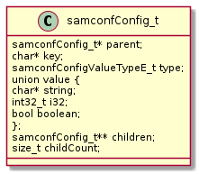
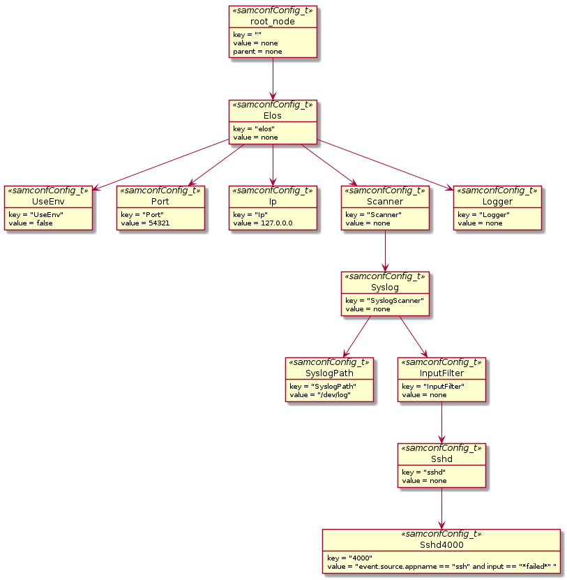
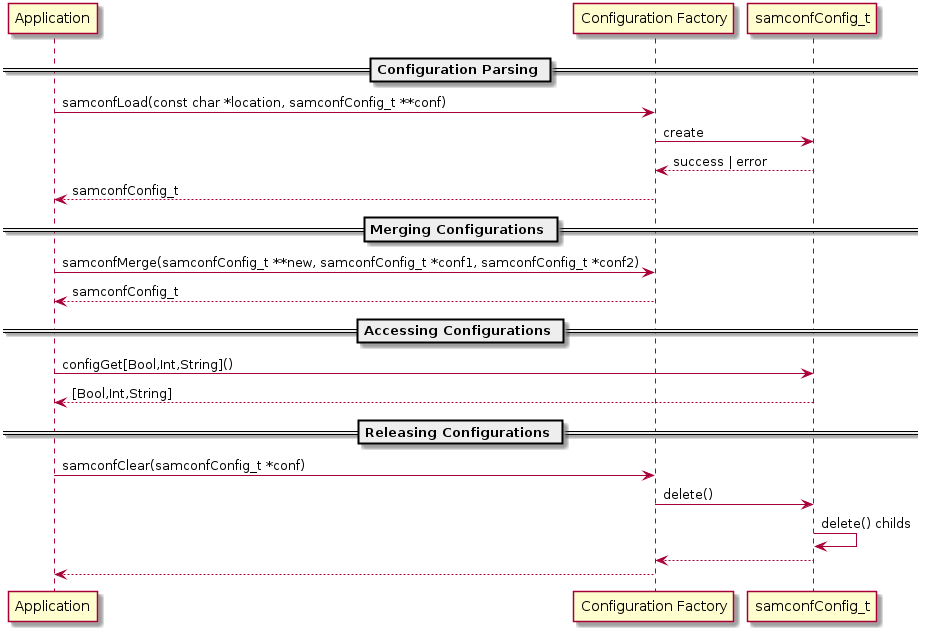
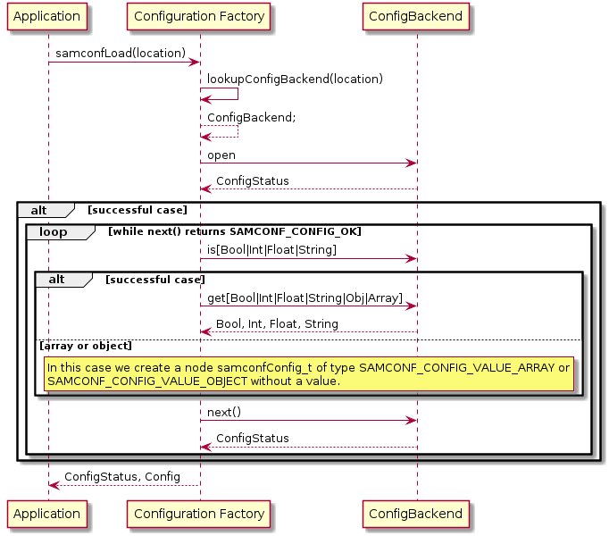
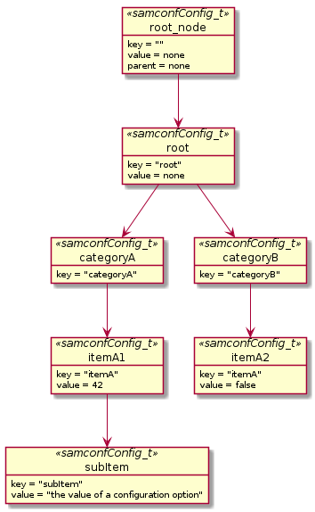

# samconf

This library has the following main tasks:

* Manage program configurations through a centralized configuration API.
* Merge arbitrary sources for configuration like Json and/or Xml, program
  parameters, environment and compile/buildin configurations.
* Transparently verify signed configurations


## General Structure

The configuration is held in a tree structure. Each tree node is of type
`samconfConfig_t`. A node can hold a value of a certain type defined by its type
attribute or in case of type _object_ and type _array_ it can hold children.
For a detailed type description have a look at the class diagram.



This structure allows a hierarchical ordering of configuration options. The following diagram shows an example configuration.



Each node can be addressed by a _xpath_ like notation. The option _SyslogPath_ of the
_Syslog-Scanner_ is for example ``/elos/scanner/syslog/SyslogPath``.

## From Configuration Source to Configuration

The _samconf_ library shall support different types of sources for configuration
options and provided a unified interface to access them. The following diagram
shows the life cycle of a configuration source.



* A configuration is created by defining a location as file path, the type is determined form the file.
* A configuration is loaded by a dedicated backend implementation.
* A configuration backend can tell if a source pointed to by given path is valid
* A configuration can *never* change after initialization
* A configuration can *not* change the underling source of information.

The data format for a configuration source type is limited by the following requirements:

* a single options must be transferable into a key value based structure
* provide hierarchical structure information for each key value pair to construct a path

This means it must be possible to implement a dedicated loader that is capable
of transforming the plain data a configuration source is pointing to into a
samconfConfig_t tree.

The process of loading a configuration from and building a configuration tree
from an arbitrary configuration source shall be done by the ConfigurationFactory component.

### The Configuration Factory

The _Configuration Factory_ shall provide an interface to abstract the details of creating a `samconfConfig_t` configuration tree, therefore it shall fullfill the following requirements:

* Easy extensibility for new source types (Open/Close principle)
* Validation of sources
* Statically linked backends
* Compile time switches for backends (-DSAMCONF_ENABLE_CONFIG_BACKEND_<name>)

The process to create a configuration source is as follows:



As the _Configuration Factory_ shall provide the developer with the mechanisms to load, merge and release a configuration tree from various sources, the public API does only define the following three functions.

```c
samconfConfigStatusE_t samconfLoad(const char *location, bool enforceSignature, samconfConfig_t **conf);
samconfConfigStatusE_t samconfMerge(samconfConfig_t **new, samconfConfig_t *conf1, samconfConfig_t *conf2);
samconfConfigStatusE_t samconfClear(samconfConfig_t *conf);
```

To provide implementations for different configuration sources the interface `samconfConfigBackend_t` shall be implemented as follows:

```c
#define samconfConfigBackendForEach(source, key, value) \
  for (...)

typedef struct samconfConfigBackendOps {
  // List of function pointers
  samconfConfigStatusE_t (*supports)(const char *location, bool *isSupported);
  samconfConfigStatusE_t (*open)(const char *location, samconfConfigBackend_t *backend);
  samconfConfigStatusE_t (*load)(samconfConfigBackend_t *backend, bool isSigned, samconfConfig_t **config);
  samconfConfigStatusE_t (*close)(samconfConfigBackend_t *backend);
} samconfConfigBackendOps_t;

typedef struct samconfConfigBackend {
  void *originalHandle; // eg. File descriptor
  void *backendHandle; // internal json object
  samconfConfigBackendOps_t *ops; // Config operations
} samconfConfigBackend_t;
```

An implementation for a specific configuration source shall implement the above functions, which can then be used by the _Configuration Factory_ to parse a configuration.

### Types of Configuration Sources

The following sources for configuration options shall be provided:

* Parameter list
* Environment variables
* JSON file
* Compiled in configuration

#### Parameter Source

A configuration option shall be passed to a program as parameter. The parsing
and the format of such parameter shall be follow the format accepted by
`getopt` libc function. The general processing rule shall be as follows:

* if a parameter is invalid or unknown return an error
* if parameter is valid insert it into a configuration tree

To integrate parameter as configuration options into a `samconfConfig_t` tree, it requires a mapping or strategy on how to place the parameter in the config tree.
There two possible solutions:

A) the parameter name must be structured like a full qualified name `--app.categoryA.itemA.subItem "the value of a configuration option"`
B) a set of parameter is mapped statically in the code to a full qualified name by the ParameterConfigLoader for example.
   ```
   $> app -p 42 --ItemB
   ```
   this will results in two options (key value pairs):
   ```
   root.categoryA.itemA = 42
   root.categoryB.itemB = true
   ```

In either case the following rules shall be applied to set the different types of values:

##### Boolean

* if a parameter is specified the corresponding option value shall be true otherwise false
* if a parameter is set explicitly to true or false the corresponding value shall be used for the corresponding option

```
-/--itemB  => /root/categoryB/itemB = true
-/--itemB=false  => root/categoryB/itemB = false
```

##### Integer

If a parameter provides an integer value it shall be converted to the configuration option type and used.

```
-/--itemA=42  => /root/categoryA/itemA = 42
-/--itemA 42  => /root/categoryA/itemA = 42
```

##### Real

If a parameter provides a real value it shall be converted to the configuration option type and used.

```
-/--itemA=42.3  => /root/categoryA/itemA = 42.3
-/--itemA 42.3  => /root/categoryA/itemA = 42.3
```

##### String

If a parameter provides a string value it shall be used.

```
-/--subItem="the value of a configuration option"  => /root/categoryA/itemA/subItem = "the value of a configuration option"
-/--subItem "the value of a configuration option"  => /root/categoryA/itemA/subItem = "the value of a configuration option"
```

#### Environment Source

To load  a configuration from an environment into a `samconfConfig_t` tree, the
Option path must be encoded in the environment variable name. Given a config
path like `/myApp/network/port` would translate to `myApp_network_port`.

An example environment config could then look like:

```
myApp_network_port = 33333
myApp_network_interface = "0.0.0.0"
myApp_network_enable = true
```

Environment variables can have the following types:

##### Boolean

If a environment parameter  contains the string `true` or `false` the
corresponding value of `SAMCONF_CONFIG_VALUE_BOOLEAN` shall be used. The
strings `true` or `false` are accepted and mapped case insensitive.
Surrounding white spaces shall be stripped.

If the value can not be mapped, the config option shall be set to
SAMCONF_CONFIG_INVALID_TYPE and the value is undefined.

```
ITEM_B="true"  => /root/categoryB/itemB = true
ITEM_B="false"  => /root/categoryB/itemB = false
ITEM_B="invalid value"  => /root/categoryB/itemB = undefined
```

##### Integer

If a parameter provides an integer value it shall be converted to the
configuration option type and used. Surrounding white spaces shall be stripped.

If the value can not be mapped, the config option shall be set to
SAMCONF_CONFIG_INVALID_TYPE and the value is undefined.

```
ITEM_A=42  => /root/categoryA/itemA = 42
ITEM_A="not a numer"  => /root/categoryA/itemA = undefined
```

##### Real

If a parameter provides a real value it shall be converted to the configuration
option type and used. Surrounding white spaces shall be stripped.

If the value can not be mapped, the config option shall be set to
SAMCONF_CONFIG_INVALID_TYPE and the value is undefined.

```
ITEM_A=42.3 => /root/categoryA/itemA = 42.3
ITEM_A="not a number"  => /root/categoryA/itemA = undefined
```

##### String

If a parameter the value is not a string representing a boolean, integer, real
or array the value it shall be used as it is.

If the environment variable is empty an empty string is used. 

If the value can not be mapped, the config option shall be set to
SAMCONF_CONFIG_INVALID_TYPE and the value is undefined.

```
SUBITEM="string value" => /root/categoryA/itemA/subItem = "string value"
SUBITEM= => /root/categoryA/itemA/subItem = ""
ITEM_A="value can not be mapped"  => /root/categoryA/itemA = undefined
```

##### Array

If a parameter provides an array it shall be converted into a configuration
node of type array and its elements added as child nodes.
Arrays are ',' separated strings and can consist of the other primitive types
boolean, integer, real or string. White spaces around the separator are
stripped. Arrays of mixed types are not supported.

If the value can not be mapped, the config option shall be set to
SAMCONF_CONFIG_INVALID_TYPE and the value is undefined.

```
SUBITEM="array" => /root/categoryA/itemA/subItem = "1,2,3,4"
SUBITEM="array" => /root/categoryA/itemA/subItem = "red, green, blue"
SUBITEM="array" => /root/categoryA/itemA/subItem = "true, false, true"
```

#### JSON File Source

The information from a JSON file is transformed in to a configuration by using the JSON object composition structure.

The following JSON object:

```json
{
  "root": {
    "categoryA" : {
      "itemA" : {
        "subItem" : {
          "value" : "the value of a configuration option"
        },
        "value" : 42
      },
    },
    "categoryB" : {
      "itemA" : false
    }
  }
}
```

will be transformed in:




#### Compiled in Source

It shall be possible to integrate a compiled in configuration tree. So it is
possible to provide compiled in defaults for configuration options. To be convenient a the confiuration values shall be privided in a static definable way like:

```c
struct samconfbuildInConfig {
  const char* key;
  const char* value;
}[] = {
  {
    .key = "/root/categoryA/itemA",
    .value = "42",
  },
};
```

## Merge multiple Config-Trees

Configurations can come from different sources, but, when converted to samconf canonical form
they are a tree data structure with root and nodes. With this structure, extension of a given
configuration is easy. New nodes can be added, existing nodes can be removed and multiple
numbers of similar configurations can be merged. Merging of multiple configurations is as shown
below.

Merging of two or more configs need:

* at least two `samconfConfig_t` trees , where one tree is where the other tree will be merged into.
* the correct order in which the trees are to be merged according the merge rules.

The following example illustrates how to merge different configuration.

*configA.json*

```json
{
    "root": {
        "elos": {
            "EventLogging": {
                "Plugins": {
                    "DLT": {
                        "File": "backend_dlt_logger.so",
                        "Run": "always",
                        "Filter": [
                            ".e.messageCode 1000 GE"
                        ],
                        "Config": {
                            "Connection": "/tmp/dlt",
                            "EcuId": "ECU1",
                            "AppId": "ELOS"
                        }
                    }
                }
            }
        }
    }
}

```

*configB.json*

```json
{
    "root": {
        "elos": {
            "EventLogging": {
                "Plugins": {
                    "fetchapi": {
                        "File": "backend_fetchapi.so",
                        "Run": "always",
                        "Filter": [
                            "1 1 EQ"
                        ],
                        "Config": {
                            "BufferSize": 150
                        }
                    }
                }
            }
        }
    }
}

```

*Config Via Environment Variable*

```shell
    ELOS_EVENTLOGGING_PLUGINS_DLT_FILE=backend_dlt_logger.so

```

The above configurations can be converted to config trees as given below


```c

result = samconfLoad("configA.json", false, &aConfig);
result = samconfLoad("configB.json", false, &bConfig);
result = samconfLoad(envVariableUri, false, &cConfig);

```

Once the config trees are created the configuration can be merged as follows:


```c

samconfConfig_t *mergedConfig = NULL;
samconfConfig_t *configsToMerge[] = {aConfig,bConfig,cConfig};
size_t configCount = ARRAY_SIZE(configsToMerge);

result = samconfConfigMergeConfigs(&mergedConfig, configsToMerge, configCount);

```

The merge process shall be fast as possible as usually configurations are read
during startup and the delay for preparing the config shall as minimal as
possible.

The samconf merge algorithm is as follows:


1) Determine where the configs are to be merged. This will be the mergedConfig.
   This can be a newly initialized config, the first config in the array of configs
   to be merged or any config.


2) Once the mergedConfig is established, the next config will be the configsToMerge.


   **For example:** if mergedConfig is the first element of the configs array, then
   the second config will be the configToMerge.


3) Iterate through each of the nodes in the configToMerge, get the node path and check if
   the node is present with the same path in the mergedConfig.


4) If the check is yes than check the signage of mergedConfig and ConfigToMerge and edit
   node value according to the merge rules.


5) If the check is no then add the node to mergedConfig if the configToMerge follows
   the merge rules.


6) Once all nodes in configToMerge are completed set next config in array as configToMerge


7) Repeat steps 3-5 again.


### Merge Rules

When merging multiple configuration there arises conflicts when two
configurations have the same values. The following rules are used for
conflict resolution :

1) In order of precedence
   - The order of precedence is decided by the user.
   - The processing starts with the lowest priority for the first and ends with
     the highest priority on the last given configuration.
   - A configuration option with lower priority can be overwritten with a
     configuration option with high priority in the order, if the options
     follow the other merge rules.

2) Only an option from signed source can overwrite an option from signed source.
   - Signed configurations are those that have their a signature file present.

3) An option from a unsigned source can be overwritten by an option from a signed or unsigned source.
   - Unsigned configurations are those without accompanying verification files. 
   - User should make sure custom configurations are signed for the changes to take place.

4) An unsigned option can **NOT** overwrite a signed option


#### Example : Applying the merge rules

In the given scenario the configuration files for an application *my_app* are
located in the file system in a common way aligned to common best practices (see.  
[FHS](https://refspecs.linuxfoundation.org/FHS_3.0/fhs/index.html),
[systemd-conf](https://www.freedesktop.org/software/systemd/man/latest/systemd-system.conf.html#Configuration%20Directories%20and%20Precedence)
or [XDG basedir-spec](https://specifications.freedesktop.org/basedir-spec/latest/#basics)
). 

```
/
├── etc
│   └── my_app.d
│        ├── 10_my_app_config.json
│        └── 10_my_app_config.sig
├── home
│   └── username
│       └── .local
│            ├── 20_my_app_config.json 
│            └── 20_my_app_config.sig
└── usr
    └── share
        ├── my_app
        │   └── 40_my_app_config.json 
        └── lib
            └── 80_my_app_config.json 

```

Then the user shall load the configurations in the code for *my_app* application as follows:

```c
samconfConfig_t *etcConfig = NUll;
samconfConfig_t *localConfig = NUll;
samconfConfig_t *usraConfig = NUll;
samconfConfig_t *usrbConfig = NUll;
samconfLoad("/etc/my_app.d/10_my_app_config.json", true, &etcConfig);
samconfLoad("/home/username/.local/20_my_app_config.json", true, &localConfig);
samconfLoad("/usr/share/my_app/40_my_app_config.json", false, &usraConfig);
samconfLoad("/usr/share/lib/80_my_app_config.json", false, &usrbConfig);
```

Once all the configurations are loaded and are available in the canonical tree form, these configuration trees can be merged.

Then the merge is performed in the following way:

```c
samconfConfig_t *mergedConfig = NULL;
samconfConfig_t *configsToMerge[] = {usrbConfig, usraConfig, localConfig, etcConfig};
size_t configCount = ARRAY_SIZE(configsToMerge);
result = samconfConfigMergeConfigs(&mergedConfig, configsToMerge, configCount);
```

The order in which the configurations are loaded indicates the priority
starting with the lowest and ending with the highest. Again as stated above,
this is to be determined by the user. `Samconf` does not automatically order
the configurations. 
When a merge is performed this way, then the order of precedence is as follows :

| **Location**                                   | **Priority**  |
|:---                                            |    :-----:    |
| Command Line Arguments (if available)          | <div style="width: 100%; height: 10px; background-color:#3357FF;"></div> |
| Environment Variables (if available)           | <div style="width: 80%; height: 10px; background-color: #3357FF;"></div> |
| /etc/my\_app.d/10\_my\_app\_config.json        | <div style="width: 60%; height: 10px; background-color: #3357FF;"></div> |
| /home/username/.local/20\_my\_app\_config.json | <div style="width: 60%; height: 10px; background-color: #3357FF;"></div> |
| /usr/share/my\_app/40\_my\_app\_config.json    | <div style="width: 20%; height: 10px; background-color: #3357FF;"></div> |
| /usr/share/lib/80\_my\_app\_config.json        | <div style="width: 10%; height: 10px; background-color: #3357FF;"></div> |


Another common approach is to specify a configuration directory `my_app.d` with
more than one configuration file to be loaded. 

```
/
 └──etc
    └── my_app.d
        ├── 10_my_app_config.json
        ├── 10_my_app_config.sig
        ├── 20_my_app_config.json
        ├── 20_my_app_config.sig
        ├── 30_my_app_config.json
        └── 30_my_app_config.sig

```

The Files should be sorted alphabetically and the first file in the above case
`10_my_app_config.json` has least priority and can be overwritten with values
from the preceding files, where the last file has the highest priority which in
this case is `30_my_app_config.json`.


## Public API

### Building a Configuration Tree

In order to generate a `samconfConfig_t` tree from a specific source, you will do something like:

```c
const char *location = "/path/to/conf.json";
samconfConfig_t *config;
samconfConfigStatusE_t status;

status = samconfLoad(location, true, &conf);
if (status != SAMCONF_CONFIG_OK)
    // Include error handling here
```

### Merging Configuration Trees

In order to combine different configuration sources like json files and commandline parameters, you can merge them:

```c
// Create config from source as shown in [Building a Configuration Tree](#Building a Configuration Tree)
// Load json config and commandline parameters

status = samconfConfigMergeConfig(&config, jsonConfig, parameters);
or
status = samconfConfigMergeConfigs(&config, {config_1,...,config_n}, numberofconfigs);

if (status != SAMCONF_CONFIG_OK)
    // Include error handling here
```

### Clearing Configuration Trees

In order to clean up configuration trees, you can use `samconfConfigDeleteMembers`:

```c
samconfConfig_t *config;
samconfConfigStatusE_t status;

// Load the configuration and do your thing

status = samconfConfigDeleteMembers(config);
```

## Internal API

### Data Types

#### samconfConfigStatusE_t

This enum defines the result of an operation in the configuration library. All function shall use this to indicate a success or give a reason what happened.

```c
typedef enum samconfConfigStatusE {
  SAMCONF_CONFIG_ERROR = -1,
  SAMCONF_CONFIG_OK = 0,
  SAMCONF_CONFIG_EOF,
  SAMCONF_CONFIG_NOT_FOUND,
  SAMCONF_CONFIG_INVALID_TYPE,
  SAMCONF_CONFIG_PARSE_ERROR,
} samconfConfigStatusE_t;
```

#### samconfConfigValueTypeE_t

This enum defines the data type of a value that a node can have or ``SAMCONF_CONFIG_VALUE_NONE`` if the node is empty and just to maintain a structure or ordering of the configuration.

```c
typedef enum samconfConfigValueTypeE {
  SAMCONF_CONFIG_VALUE_NONE = 0,
  SAMCONF_CONFIG_VALUE_STRING,
  SAMCONF_CONFIG_VALUE_INT,
  SAMCONF_CONFIG_VALUE_REAL,
  SAMCONF_CONFIG_VALUE_ARRAY,
  SAMCONF_CONFIG_VALUE_OBJECT,
} samconfConfigValueTypeE_t;
```

#### samconfConfig_t

This structure is the central key component. It represents a node in the configuration tree. It has a name the ``key`` and can contain a value and/or references to further `samconfConfig_t` child nodes. It also maintains a reference to its parent `samconfConfig_t` node. In case the parent node reference is `NULL` it is the top level node of the configuration tree.

```c
typedef struct samconfConfig {
  samconfConfig_t *parent;
  char *key;
  samconfConfigValueTypeE_t type;
  union value {
    char *string;
    int32_t integer;
    bool boolean;
    double real;
  };
  samconfConfig_t **children;
  size_t childCount;
} samconfConfig_t;
```

#### samconfConfigBackendOps_t

This structure defines the internal interface used by the _Configuration Factory_ to parse the configuration source format into a `samconfConfig_t` configuration tree. Every backend has to implement these functions as static functions and provide an instance including the required function pointers to these internal functions.

```c
typedef struct samconfConfigBackendOps {
  // List of function pointers
  bool (*supports)(const char *location);
  samconfConfigStatusE_t (*open)(const char *location, samconfConfigBackend_t *backend);
  samconfConfigStatusE_t (*load)(samconfConfigBackend_t *backend, bool isSigned, samconfConfig_t **config);
  samconfConfigStatusE_t (*close)(samconfConfigBackend_t *backend);
} samconfConfigBackendOps_t;
```

#### samconfConfigBackend_t

This struct is used to maintain a state during parsing of configuration source format into a `samconfConfig_t` configuration tree by the _Configuration Factory_. Therefore it holds a reference to the configuration backend operations and different stateful variables.

```c
typedef struct samconfConfigBackend {
  void *originalHandle; // eg. File descriptor
  void *backendHandle; // internal json object
  samconfConfigBackendOps_t *ops; // Config operations
} samconfConfigBackend_t;
```

#### samconfConfigSourceTypeE_t

The samconfConfigSourceTypeE_t enum defines all types of supported sources for a configuration option (or node).

```c
  typedef enum samconfConfigSourceTypeE {
    SAMCONF_CONFIG_SOURCE_TYPE_NONE = 0,
    SAMCONF_CONFIG_SOURCE_TYPE_PARAMETER,
    SAMCONF_CONFIG_SOURCE_TYPE_ENVIRONMENT,
    SAMCONF_CONFIG_SOURCE_TYPE_FILE,
    SAMCONF_CONFIG_SOURCE_TYPE_BUILDIN,
  } samconfConfigSourceTypeE_t;
```

#### samconfConfigSource_t

The samconfConfigSource_t is used to describe the origin of a configuration option (or node). It only manages the specific type of a configuration source (eg. file, command line argument or environment variable) and a corresponding backend for the used data format.
The samconfConfigBackened_t will be initialized for each interaction with a new source configuration and will hold the original handle (eg. a file descriptor), an internal handle like the `struct json_object` of _json-c_ and the pointer to the configuration operations for this specific backend (eg. _json_, _yaml_, _ini_).
The configuration operations are stored in an samconfConfigBackendOps_t and will be initialized to a list of function pointers used to interact with the specific data format.

```c
typedef struct samconfConfigSource {
  samconfConfigSourceTypeE_t type;
  samconfConfigBackend_t *backend;
} samconfConfigSource_t;
```

To create a configuration the following set of functions is given:

```c
samconfConfigStatusE_t samconfConfigNew(samconfConfig_t **config)
samconfConfigStatusE_t samconfConfigInit(samconfConfig_t *config)
samconfConfigStatusE_t samconfConfigClone(samconfConfig_t **to, samconfConfig_t *from)
samconfConfigStatusE_t samconfConfigDeepCopy(samconfConfig_t *to, samconfConfig_t *from)
samconfConfigStatusE_t samconfConfigDelete(samconfConfig_t *config)
samconfConfigStatusE_t samconfConfigDeleteMembers(samconfConfig_t *config)

samconfConfigStatusE_t samconfConfigAddNodeAt(samconfConfig_t *root, char *path, samconfConfig_t *newChild)

samconfConfigStatusE_t samconfConfigLoaderLoad(samconfConfigSourceTypesE_t type, void* location, samconfConfigSource_t* configSource);

samconfConfigStatusE_t samconfConfigBackendNew(samconfConfigBackend_t **backend, samconfConfigBackendOps *ops)
samconfConfigStatusE_t samconfConfigBackendInit(samconfConfigBackend_t *backend, samconfConfigBackendOps *ops)
```

```c
bool samconf<Type>Supported(void* location);
samconfConfigStatusE_t samconf<Type>BackendLoad(void* location, bool isSigned, samconfConfigSource_t* configSource)
samconfConfigStatusE_t samconf<Type>BackendClose(samconfConfigBackend_t *backend)

samconfConfigStatusE_t samconfConfigBuilderBuild(samconfConfigSource_t*, samconfConfig_t* config)
samconfConfigStatusE_t samconfConfigBuilderMerge(vec<samconfConfig_t>* configs, samconfConfigSource_t** resultConfig)
samconfConfigStatusE_t samconfConfigBuilderRelease(vec<samconfConfig_t>* configs)

samconfConfigStatusE_t samconfJsonBackendOpen(const char * location, samconfConfigBackend_t* backend);
samconfConfigStatusE_t samconfJsonBackendLoad(samconfConfigBackend_t* backend, bool isSigned, samconfConfig_t **config);
```

#### samconfConfigNew

Shall allocate memory of size ``samconfConfig_t`` using ``safuAllocMem`` and assign its address to the given ``samconfConfig_t **`` config pointer.


```c
samconfConfigStatusE_t samconfConfigNew(
        samconfConfig_t **const config,
    );
```

Parameters:

* `[out] ` config -> the pointer to the pointer pointing to the newly allocated memory.

Returns:
* `SAMCONF_CONFIG_OK` -> on success
* `SAMCONF_CONFIG_ERROR` -> memory allocation fails

#### samconfConfigInit

Shall initialize all  member variables to 0 and member pointers to NULL for the given ``samconfConfig_t`` pointed to by config pointer.


```c
samconfConfigStatusE_t samconfConfigInit(
        samconfConfig_t *config
    );
```

Parameters:

* `[out] ` config -> the pointer to the `samconfConfig_t` to be initialized

Returns:
* `SAMCONF_CONFIG_OK` -> on successful `samconfConfig_t` initialization
* `SAMCONF_CONFIG_ERROR` -> if given pointer is NULL

#### samconfConfigDelete

Shall delete the given ``samconfConfig_t`` configuration, after its member values are deleted using ``samconfConfigDeleteMembers``. This includes all
subsequent generations of child configurations. It is important to ensure that the given configuration and its members are allocated dynamically.
This function uses the `free()` call internally, should a free() fail at any point (e.g. by trying to free an unallocated address) the result is
undefined and the program is expected to receive a SIGSEV and gets terminated on default if not treated otherwise.


```c
samconfConfigStatusE_t samconfConfigDelete(
        samconfConfig_t *config
    );
```

Parameters:

* `[in] ` config -> the pointer to the configuration that needs to be deleted.

Returns:
* `SAMCONF_CONFIG_OK` -> on successfull deletion of given configuration
* `SAMCONF_CONFIG_ERROR` -> deletion of configuration fails upon receiving invalid/null input value

#### samconfConfigDeleteMembers

Shall delete the given ``samconfConfig_t`` configuration's member values. This includes all subsequent generations of child configurations.
It is important to ensure that the given configuration's members values are allocated dynamically. This function uses the `free()` call internally,
should a free() fail at any point (e.g. by trying to free an unallocated address) the result is undefined and the program is expected to receive a
SIGSEV and gets terminated on default if not treated otherwise.


```c
samconfConfigStatusE_t samconfConfigDeleteMembers(
        samconfConfig_t *config
    );
```

Parameters:

* `[in] ` config -> the pointer to the configuration whose member values need to be deleted.

Returns:
* `SAMCONF_CONFIG_OK` -> on successful deletion member values of given configuration
* `SAMCONF_CONFIG_ERROR` -> deletion of member values of given configuration fails upon receiving invalid/null input value

Note:
* The function returns an `SAMCONF_CONFIG_ERROR` when given configuration to be deleted is NULL. In cases like deleting already deleted configuration
or trying to delete a configuration in stack, the functions is expected to be terminated by a SIGSEG.

#### samconfConfigLoaderLoad

Shall lookup an appropriate samconfConfigBackend_t implementation for
samconfConfigSourceTypesE_t to forward the `load` call to. If no backend can be
determined or the backend returns an error, an appropriate error value shall be
returned. On success the structure pointed to by the samconfConfigSource_t
pointer is populated and SAMCONF_CONFIG_OK shall be returned.

```c
samconfConfigStatusE_t samconfConfigLoaderLoad(
        samconfConfigSourceTypesE_t type,
        void* location,
        samconfConfigSource_t* configSource
    );
```

Parameters:

* `[in] `  type         -> samconfConfigSourceTypesE_t value specifying the source type.
* `[in] `  location     -> a pointer to a structure specified by the source type backend.
* `[out] ` configSource -> a pointer to a samconfConfigSource_t object that shall be initialized.

Returns:
* `SAMCONF_CONFIG_OK` -> on success
* `SAMCONF_CONFIG_ERROR` -> failed to setup the configuration source (not accessible, failed to verify, no suitable backend)

#### samconfConfigBackendNew

Shall allocate memory of size ``samconfConfigBackend_t`` using ``safuAllocMem``, initialize it by calling ``samconfConfigBackendInit`` and assign the backend address to the given ``samconfConfigBackend_t **`` configuration backend pointer.

```c
samconfConfigStatusE_t samconfConfigBackendNew(
        samconfConfigBackend_t** backend,
        const samconfConfigBackendOps_t* ops
    );
```

Parameters:

* `[out] ` backend -> the pointer to the pointer pointing to the newly allocated memory.
* `[in] ` ops -> the pointer to backend operations struct.

Returns:
* `SAMCONF_CONFIG_OK` -> on success
* `SAMCONF_CONFIG_ERROR` -> memory allocation fails

#### samconfConfigBackendInit

Shall initialize the `samconfConfigBackend_t*` with the source format specific file operations.

```c
samconfConfigStatusE_t samconfCongifBackendInit(
        samconfConfigBackend_t* backend,
        const samconfConfigBackendOps_t* ops
    );
```

Parameters:

* `[out] ` backend -> a pointer to a samconfConfigBackend_t object that shall be initialized.
* `[in] ` ops -> the pointer to backend operations struct.

Returns:
* `SAMCONF_CONFIG_OK` -> on success

#### samconfConfigBackendDelete

Shall free the memory of the given ``samconfConfigBackend_t`` pointer.

```c
samconfConfigStatusE_t samconfConfigBackendDelete(
        samconfConfigBackend_t* backend
    );
```

Parameters:

* `[in] ` backend -> the pointer to the configuration backend.

Returns:
* `SAMCONF_CONFIG_OK` -> on success

#### samconfJsonBackendOpen

Shall locate and open a JSON file and store the necessary handles to access the content in backend->backendHandle

```c
samconfConfigStatusE_t samconfJsonBackendOpen(
        const char * location,
        samconfConfigBackend_t* backend
    );
```

Parameters:
* `[in]` location -> Path of the json config file.
* `[in]` backend -> a pointer to a samconfConfigSource_t object, which contains the samconfConfigBackend_t object containing the pointer to the that shall be initialized.

Returns:
* `SAMCONF_CONFIG_OK` -> on success
* `SAMCONF_CONFIG_ERROR` -> failed to setup the configuration source (not accessible, failed to verify)

#### samconfJsonBackendSupports

Shall check if the content of the given file contains a Json document and is processable by this backend.

```c
samconfConfigStatusE_t samconfJsonBackendSupports(
        const char *location,
        bool *isSupported
    );
```
Parameters:
* `[in]` location -> Path of the file whose extension is checked.
* `[out]` isSupported -> Pointer flag indicating support for given file extension.

Returns:
* `SAMCONF_CONFIG_OK` -> if given file extension is supported.
* `SAMCONF_CONFIG_ERROR` -> if error occurs.

#### samconfJsonBackendClose

Shall free all Memory related to a given samconfConfigBackend_t struct.

```c
samconfConfigStatusE_t samconfJsonBackendLoad(
        samconfConfigBackend_t *backend
    );
```

Parameters:

* `[in] ` configSource -> a pointer to a samconfConfigBackend_t struct which shall be closed.

Returns:
* `SAMCONF_CONFIG_OK` -> on success
* `SAMCONF_CONFIG_ERROR` -> failed to free the json object completly

#### samconfJsonBackendLoad

Shall parse json_object data from given backend into a samconfConfig_t *.

```c
samconfConfigStatusE_t samconfJsonBackendLoad(
        samconfConfigBackend_t *backend,
        bool isSigned,
        samconfConfig_t **config
    );
```

Parameters:

* `[in] ` backend -> a pointer to a samconfConfigBackend_t struct which contains the to be parsed json_object *.
* `[in] ` isSigned -> whether or not the given configuration file is signed.
* `[out] ` config -> a pointer pointer to the root of the to-be-built config tree.

Returns:
* `SAMCONF_CONFIG_OK` -> on success
* `SAMCONF_CONFIG_ERROR` -> failed to build the complete config tree.

#### samconfConfigBuilderBuild

Shall create a configuration tree based on all available configuration options
from samconfConfigSource_t and create a configuration tree and store the root
node in the pointer pointed to by config.

```c
samconfConfigStatusE_t samconfConfigBuilderBuild(
        samconfConfigSource_t* configSource,
        samconfConfig_t** config
    );
```

Parameters:

* `[in] `  configSource -> a pointer to the configurations source to use to build a configuration tree.
* `[out] ` config       -> a pointer to a samconfConfig_t pointer to return the new configuration tree.

Returns:
* `SAMCONF_CONFIG_OK` -> on success
* `SAMCONF_CONFIG_ERROR` -> failed to build the configuration tree

#### samconfConfigBuilderRelease

Shall free and release all allocated resources related to the provided configuration tree. The implementation shall try to free resources even if one or more child elements could not be freed.

```c
samconfConfigStatusE_t samconfConfigBuilderRelease(
        samconfConfig_t* configs
    );
```

Parameters:

* `[in] `  config -> the pointe to a configuration root node

Returns:
* `SAMCONF_CONFIG_OK` -> on success
* `SAMCONF_CONFIG_ERROR` -> failed to free or release at least one child node or configSource

### query a configuration tree

```c
* samconfConfigStatusE_t samconfConfigGet(samconfConfig_t *root, const char *path, samconfConfig_t **result)
* samconfConfigStatusE_t samconfConfigGetString(samconfConfig_t *root, const char *path, const char **result)
* samconfConfigStatusE_t samconfConfigGetInt32(samconfConfig_t *root, const char *path, int32_t *result)
* samconfConfigStatusE_t samconfConfigGetBool(samconfConfig_t *root, const char *path, bool *result)
```
#### samconfConfigAdd

Shall add the given ``samconfConfig_t`` child node to the given parent node.

```c
samconfConfigStatusE_t samconfConfigAdd(
        samconfConfig_t *parent,
        samconfConfig_t *child
    );
```

Parameters:
* `[in]` parent    -> node to which given child is added
* `[in]` child     -> child node to be added to  parent

Returns:
* `SAMCONF_CONFIG_OK`        -> when given child node is added successfully to the parent node.
* `SAMCONF_CONFIG_ERROR`     -> when child node could not be added to parent node.

#### samconfConfigGet

Make a lookup for a given path relative to the given ``samconfConfig_t`` root node.

A path looks like ``/elos/scanner/syslog/SyslogPath``, where ``SyslogPath`` is the target node and all other are parents.


```c
samconfConfigStatusE_t samconfConfigGet(
        const samconfConfig_t *root,
        const char *path,
        const samconfConfig_t **result
    );
```

Parameters:

* `[in] `  root      -> root node where to start the lookup
* `[in] `  path      -> the search path pointing to the searched samconfConfig_t node relative to the root node
* `[out] ` result    -> the pointer to the searched node or NULL if not found

Returns:
* `SAMCONF_CONFIG_OK`        -> on success
* `SAMCONF_CONFIG_NOT_FOUND` -> no node can be found following the given path starting at the given root node

#### samconfConfigGetString

Make a lookup for a given path relative to the given ``samconfConfig_t`` root node and if found return the value as string.

A path looks like ``/elos/scanner/syslog/SyslogPath``, where ``SyslogPath`` is the target node and all other are parents.


```c
samconfConfigStatusE_t samconfConfigGetString(
        const samconfConfig_t *root,
        const char *path,
        const char **result
    );
```

Parameters:

* `[in] `  root      -> root node where to start the lookup
* `[in] `  path      -> the search path pointing to the searched samconfConfig_t node relative to the root node
* `[out] ` result    -> the pointer to the string value of the samconfConfig_t node

Returns:
* `SAMCONF_CONFIG_OK`           -> on success
* `SAMCONF_CONFIG_NOT_FOUND`    -> no node can be found following the given path starting at the given root node
* `SAMCONF_CONFIG_INVALID_TYPE` -> the node exists but contains no value of the requested type

#### samconfConfigSetString

Shall copy the ``const char*`` stringValue to the given ``samconfConfig_t`` config node and set config node's  type to ``SAMCONF_CONFIG_VALUE_STRING``.


```c
samconfConfigStatusE_t samconfConfigSetString(
        samconfConfig_t *config,
        const char *stringValue
)
```

Parameters:
* `[in]` config       -> the ``samconfConfig_t`` node whose type should set to string and value is set to given string value.
* `[in]` stringValue  -> the string which is copied to ``config->value``

Returns:
* `SAMCONF_CONFIG_OK`    -> on success
* `SAMCONF_CONFIG_ERROR` -> when invalid input is given or the string could not be copied

#### samconfConfigGetBool

Make a lookup for a given path relative to the given ``samconfConfig_t`` root node. If boolean value is found assign it to result, if not then result is not assigned any value.

A path looks like ``/elos/scanner/syslog/SyslogPath``, where ``SyslogPath`` is the target node and all other are parents.


```c
samconfConfigStatusE_t samconfConfigGetBool(
        const samconfConfig_t *root,
        const char *path,
        bool *result
    );
```

Parameters:

* `[in] `  root      -> root node where to start the lookup
* `[in] `  path      -> the search path pointing to the searched samconfConfig_t node relative to the root node
* `[out] ` result    -> the pointer where to store the boolean value of the samconfConfig_t node

Returns:
* `SAMCONF_CONFIG_OK`           -> on success
* `SAMCONF_CONFIG_NOT_FOUND`    -> no node can be found following the given path starting at the given root node
* `SAMCONF_CONFIG_INVALID_TYPE` -> the node exists but contains no value of the requested type

#### samconfConfigSetBool

Shall set the ``bool`` value to the given ``samconfConfig_t`` config node and set config node's  type to ``SAMCONF_CONFIG_VALUE_BOOLEAN``.


```c
samconfConfigStatusE_t samconfConfigSetBool(
        samconfConfig_t *config,
        bool value
)
```

Parameters:
* `[in]` config    -> the ``samconfConfig_t`` node whose type should set to boolean and value is set to given bool value.
* `[in]` value     -> the boolean value to set to ``config->value``

Returns:
* `SAMCONF_CONFIG_OK`    -> on success
* `SAMCONF_CONFIG_ERROR` -> when invalid input is given

#### samconfConfigGetInt32

Make a lookup for a given path relative to the given ``samconfConfig_t`` root node. If Int32 value is found assign it to result.If no value is found or when error is encountered, then result is not assigned any value.

A path looks like ``/elos/scanner/syslog/SyslogPath``, where ``SyslogPath`` is the target node and all other are parents.


```c
samconfConfigStatusE_t samconfConfigGetInt32(
        const samconfConfig_t *root,
        const char *path,
        int32_t *result
    );
```

Parameters:

* `[in] `  root      -> root node where to start the lookup
* `[in] `  path      -> the search path pointing to the searched samconfConfig_t node relative to the root node
* `[out] ` result    -> the pointer where to store the int32 value of the samconfConfig_t node

Returns:
* `SAMCONF_CONFIG_OK`           -> on success
* `SAMCONF_CONFIG_NOT_FOUND`    -> no node can be found following the given path starting at the given root node
* `SAMCONF_CONFIG_INVALID_TYPE` -> the node exists but contains no value of the requested type

#### samconfConfigSetInt

Shall set the ``int64_t`` intValue to the given ``samconfConfig_t`` config node and set config node's  type to ``SAMCONF_CONFIG_VALUE_INT``.


```c
samconfConfigStatusE_t samconfConfigSetInt(
        samconfConfig_t *config,
        int64_t intValue
)
```

Parameters:
* `[in]` config    -> the ``samconfConfig_t`` node whose type should set to integer and value is set to given interger value.
* `[in]` intValue  -> the integer value to set to ``config->value``

Returns:
* `SAMCONF_CONFIG_OK`    -> on success
* `SAMCONF_CONFIG_ERROR` -> when invalid input is given

#### samconfConfigGetReal

Make a lookup for a given path relative to the given ``samconfConfig_t`` root node. If Real value is found assign it to result.If no value is found or when error is encountered, then result is not assigned any value.

A path looks like ``/elos/scanner/syslog/SyslogPath``, where ``SyslogPath`` is the target node and all other are parents.


```c
samconfConfigStatusE_t samconfConfigGetReal(
        const samconfConfig_t *root,
        const char *path,
        double *result
    );
```

Parameters:

* `[in] `  root      -> root node where to start the lookup
* `[in] `  path      -> the search path pointing to the searched samconfConfig_t node relative to the root node
* `[out] ` result    -> the pointer where to store the real value of the samconfConfig_t node

Returns:
* `SAMCONF_CONFIG_OK`           -> on success
* `SAMCONF_CONFIG_NOT_FOUND`    -> no node can be found following the given path starting at the given root node
* `SAMCONF_CONFIG_INVALID_TYPE` -> the node exists but contains no value of the requested type

#### samconfConfigSetReal

Shall set the ``double`` value to the given ``samconfConfig_t`` config node and set config node's  type to ``SAMCONF_CONFIG_VALUE_REAL``.


```c
samconfConfigStatusE_t samconfConfigSetReal(
        samconfConfig_t *config,
        double value
)
```

Parameters:
* `[in]` config    -> the ``samconfConfig_t`` node whose type should set to real and value is set to given double value.
* `[in]` value     -> the double value to set to ``config->value``

Returns:
* `SAMCONF_CONFIG_OK`    -> on success
* `SAMCONF_CONFIG_ERROR` -> when invalid input is given
